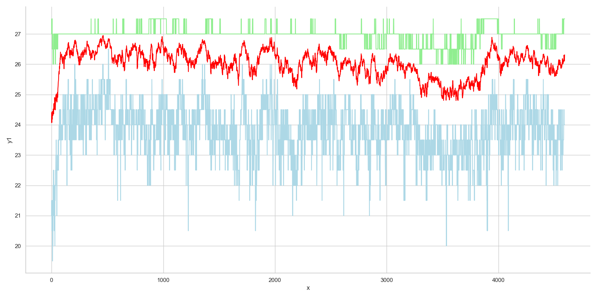
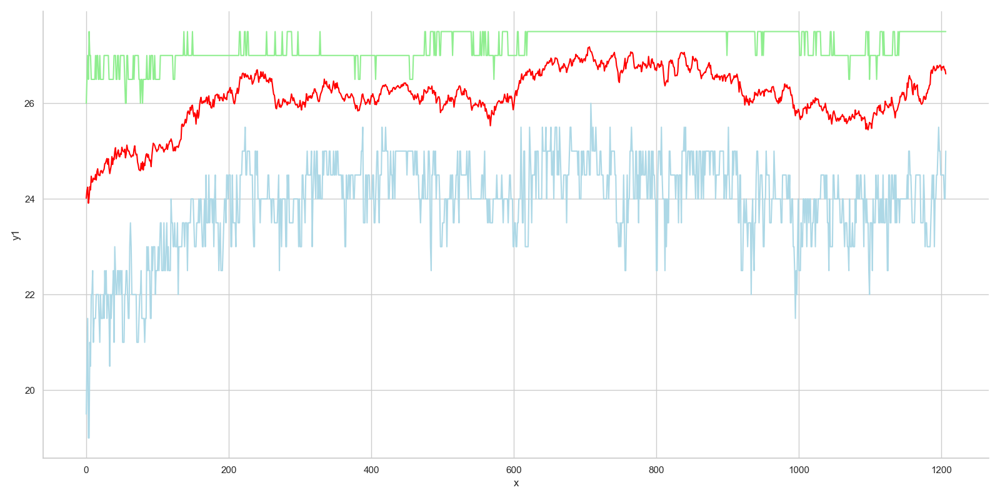
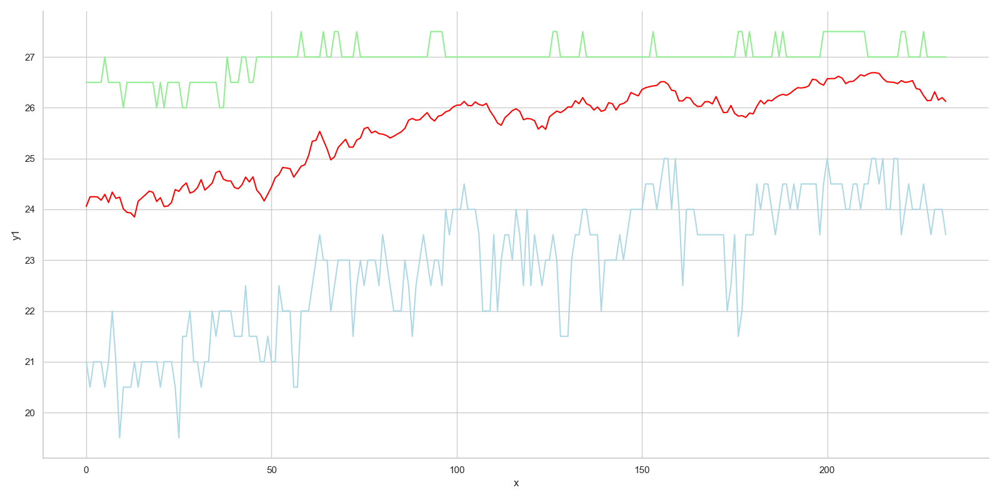
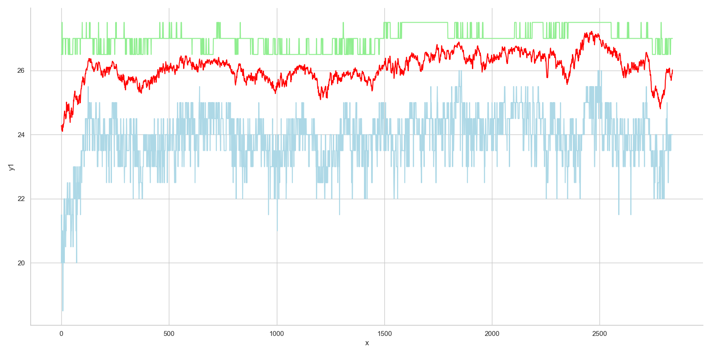
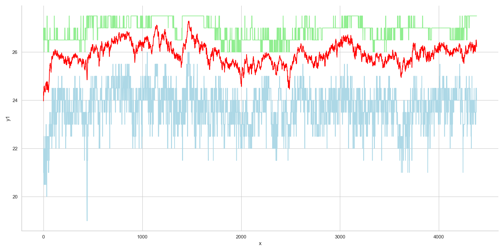
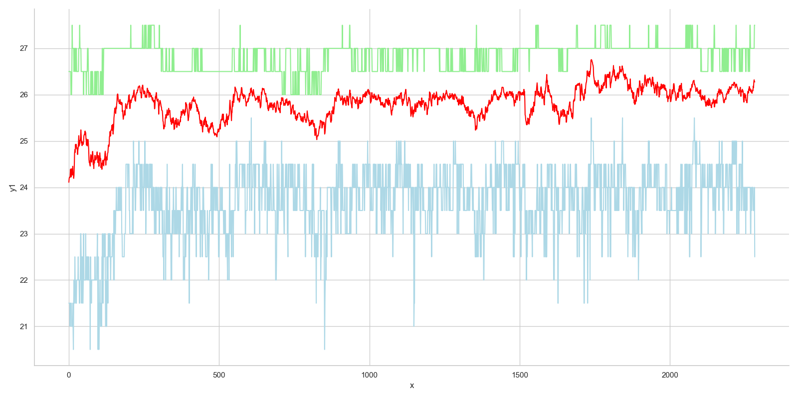
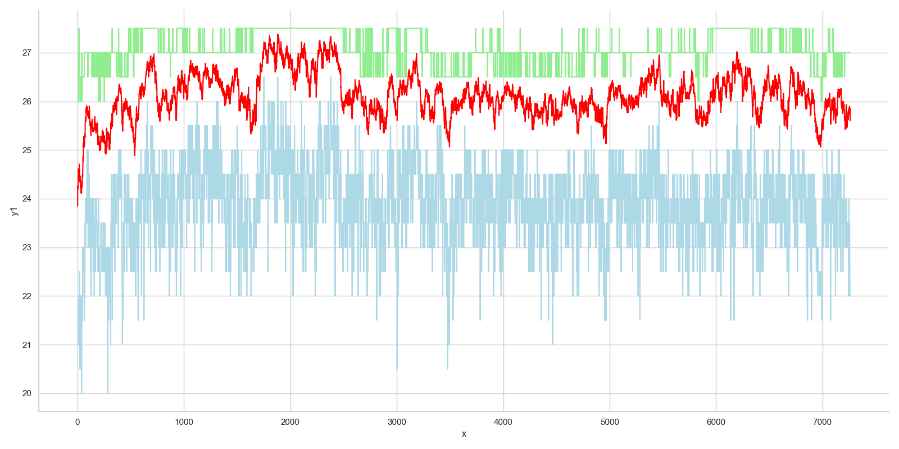

# Solving the problem
Genetic algorithm example - 8 queens problem

### Test run 1 - basic algorithm
Running the basic algorithm with the following parameters: 
* population N=100
* 8 queens 
* probability of mutation Pm=0.03

| Run  | Generations  | Time elapsed (seconds)  | Converged  |
|---|---|---|---|
| 1  | 7263  | 192.4  | Yes  |
| 2  | 2283  | 60.3  |  Yes |
| 3  | 4384  | 121.3  | Yes  |
| 4  | 2839  | 75.4  |  Yes |
| 5 | 233  |  6.3 |  Yes |
| 6  | 1207  | 32.2  | Yes  |
| 7  | 4593  | 121.6  | Yes  |
| 8  | 1444  | 39.1  | Yes  |
| 9  | 440  | 11.3  | Yes  |
| 10  | 328  | 8.4  | Yes  |
| **Avg**  | **2501.4**  | **66.8**  | #  |
| **Min**  | **233**  | **6.3**  | #  |
| **Max**  | **7263**  | **192.4**  | #  |
| **Stddev**  | **2500.1**  | **66.5**  | #  |

### Appendix

#### Appendix 1 - test run results, basic algorithm

Legend:
* Red colour - average fitness of one state
* Blue colour - worst fitness of one state
* Green colour - Best fitness of one state

