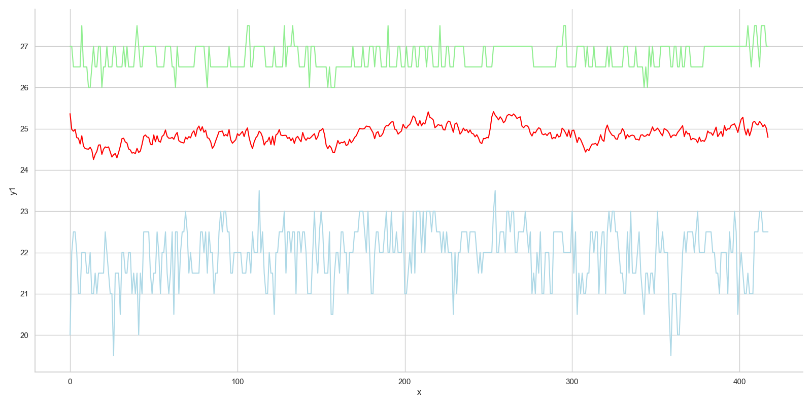

# Solving the problem
Genetic algorithm example - 8 queens problem

### Modifications to the skeleton code excluding enhancements

* supporting N queens for any N>=2
* adding fitness score and calculating it once to avoid recomputing
* adding a separate class representing the population 

### Supporting N queens for any N>=2

The skeleton code has been generalized to work with any positive number of queens (N>=2).

### Generating initial states by avoiding same row clashes

When generating the individuals a simple rules is enforced .

```python
    def culling(self, percent=0.8):
        """Remove X% of the least fit from the list"""
        l = sorted(self._pop, key=lambda x: x.fitness(), reverse=True)
        take = int(percent*len(l))
        shuffle(l[:take])
        self._pop = l
```

### Culling

Out of the population of potential individuals the best 80% is chosen to mate and produce offspring. The relevant function is culling and it sorts the population based on the fitness score and then cuts off the least performing 20%.

```python
    def culling(self, percent=0.8):
        """Remove X% of the least fit from the list"""
        l = sorted(self._pop, key=lambda x: x.fitness(), reverse=True)
        take = int(percent*len(l))
        shuffle(l[:take])
        self._pop = l
```

### Elitism

To avoid losing the best individuals in the population, a certain percentage of the best of the preceding generation is passed on to the next. It is combined with culling so that instead of reducing the total population, the culled percentage is replaced by the top X% of the preceding generation.

```python
        def culling(self, percent=0.8, elite=None):
        """Remove X% of the least fit from the list based on fitness score"""
        l = sorted(self._pop, key=lambda x: x.fitness(), reverse=True)
        take = int(percent*len(l))
        l = l[:take]
        if elite:
            l.extend(elite)
        shuffle(l)
        self._pop = l

    def get_elite(self, percent=0.2):
        """Return top X% individuals based on the fitness score"""
        l = sorted(self._pop, key=lambda x: x.fitness(), reverse=True)
        take = int(percent*len(l))
        return l[:take]
```
### Adjusting the population size and the mutation rate

After trying out several different values for the population size it became obvious that in combination with culling and elitism larger population is preferable. Starting with N=100 considerable improvements in speed (4x) were observed by increasing the population size to N=1000. 

Mutation rate was another parameter that proved crucial. Several rates between 1%-10% were used and the mutation rate between 7%-10% proved to be optimal for speed.

### Test run 1 - basic algorithm without improvements
Running the basic algorithm with the following parameters: 
* population N=100
* 8 queens 
* probability of mutation Pm=0.03

| Run  | Generations  | Time elapsed (seconds)  | Converged  |
|---|---|---|---|
| 1  | 7263  | 192.4  | Yes  |
| 2  | 2283  | 60.3  |  Yes |
| 3  | 4384  | 121.3  | Yes  |
| 4  | 2839  | 75.4  |  Yes |
| 5 | 233  |  6.3 |  Yes |
| 6  | 1207  | 32.2  | Yes  |
| 7  | 4593  | 121.6  | Yes  |
| 8  | 1444  | 39.1  | Yes  |
| 9  | 440  | 11.3  | Yes  |
| 10  | 328  | 8.4  | Yes  |
| **Avg**  | **2501.4**  | **66.8**  | #  |
| **Min**  | **233**  | **6.3**  | #  |
| **Max**  | **7263**  | **192.4**  | #  |
| **Stddev**  | **2500.1**  | **66.5**  | #  |

### Test run 2 - improving initial states generation by avoiding queens in same rows

| Run | Generations | Time elapsed | Converged |
| --- | ----------- | ------------ | --------- |
| 1   | 1           | 0,03         | Yes       |
| 2   | 999         | 27,80        | Yes       |
| 3   | 5864        | 160,00       | Yes       |
| 4   | 1299        | 34,70        | Yes       |
| 5   | 4767        | 129,70       | Yes       |
| 6   | 76          | 2,00         | Yes       |
| 7   | 580         | 15,60        | Yes       |
| 8   | 2634        | 71,10        | Yes       |
| 9   | 1           | 0,02         | Yes       |
| 10  | 2731        | 74,00        | Yes       |
| **Avg**   | **1895,2**      | **51,5** |   # |
| **Min**    | **1**          | **0,02**  |  # |
|  **Max**   | **5864**        | **160**  |  # |
|  **Stddev**   | **2191,4** | **59,7** |  # |

### Test run 3 - culling the population each generation and leaving only top 80% of parents to produce offspring

| Run | Generations | Time elapsed | Converged |
| --- | ----------- | ------------ | --------- |
| 1   | 812         | 23,60        | Yes       | 
| 2   | 220         | 6,50         | Yes       | 
| 3   | 830         | 25,05        | Yes       | 
| 4   | 19          | 0,50         | Yes       | 
| 5   | 755         | 22,00        | Yes       | 
| 6   | 3063        | 90,60        | Yes       | 
| 7   | 2846        | 85,20        | Yes       | 
| 8   | 3           | 0,09         | Yes       | 
| 9   | 528         | 16,20        | Yes       | 
| 10  | 4090        | 118,80       | Yes       | 
| **Avg**   | **1316,6**      | **38,9**       | #|  
| **Min**    | **3**           | **0,0**       | # | 
| **Max**    | **4090**        | **118,8**     | # | 
|  **Stddev**   | **1537,7**  | **44,9**       | #|  

### Test run 4 - bumping the mutation rate from Pm=3% to Pm=10%

| Run    | Generations | Time elapsed | Converged |
| ------ | ----------- | ------------ | --------- |
| 1      | 172         | 4,60         | Yes       |
| 2      | 418         | 11,30        | Yes       |
| 3      | 89          | 2,50         | Yes       |
| 4      | 837         | 22,60        | Yes       |
| 5      | 326         | 8,80         | Yes       |
| 6      | 358         | 10,00        | Yes       |
| 7      | 1274        | 37,00        | Yes       |
| 8      | 1071        | 30,70        | Yes       |
| 9      | 308         | 8,60         | Yes       |
| 10     | 93          | 2,70         | Yes       |
| **Avg    | **494,6**       | **13,9**        | #         |
| **Min    | **89**       | **2,5**          | #         |
| **Max    | **1274**        | **37**           | #         |
| **Stddev | **41,2** | **12,8**   | #         |

### Test run 5 - bumping the population size from N=100 to N=1000

| Run    | Generations | Time elapsed | Converged |
| ------ | ----------- | ------------ | --------- |
| 1      | 2           | 0,60         | Yes       |
| 2      | 2           | 0,60         | Yes       |
| 3      | 15          | 6,10         | Yes       |
| 4      | 4           | 1,50         | Yes       |
| 5      | 6           | 2,60         | Yes       |
| 6      | 6           | 2,60         | Yes       |
| 7      | 3           | 1,10         | Yes       |
| 8      | 24          | 9,80         | Yes       |
| 9      | 32          | 13,00        | Yes       |
| 10     | 1           | 0,14         | Yes       |
| **Avg**    | **9,5**        | **3,8**        | #         |
| **Min**    | **1**           | **0,14**         | #         |
| **Max**    | **32**          | **13**           | #         |
| **Stddev** | **11,5**  | **4,8**   | #         |


### Appendix

#### Appendix 1 - test run results, basic algorithm

Legend:
* Red colour - average fitness of one state
* Blue colour - worst fitness of one state
* Green colour - Best fitness of one state


#### Appendix 2 - test run results, basic algorithm with smarter init

Legend:
* Red colour - average fitness of one state
* Blue colour - worst fitness of one state
* Green colour - Best fitness of one state


#### Appendix 3 - test run results, basic algorithm with smarter init and culling

Legend:
* Red colour - average fitness of one state
* Blue colour - worst fitness of one state
* Green colour - Best fitness of one state


#### Appendix 4 - test run results, basic algorithm with smarter init and culling and bumped mutation rate

Legend:
* Red colour - average fitness of one state
* Blue colour - worst fitness of one state
* Green colour - Best fitness of one state




#### Appendix 5 - test run results, basic algorithm with smarter init and culling and population N=1000

Legend:
* Red colour - average fitness of one state
* Blue colour - worst fitness of one state
* Green colour - Best fitness of one state


